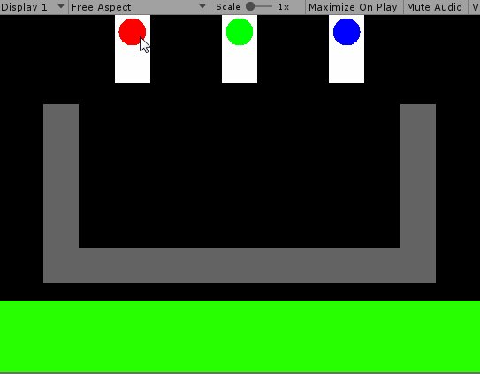
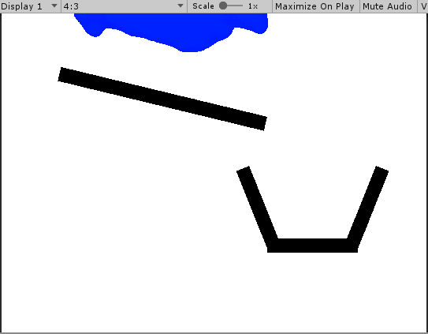

# ColorPour
Lame color mixing game with liquid sim

  

Liquid simulation achieved by using circle sprites with a radial gradient and a CircleCollider2D of a smaller radius, projected to a RenderTexture with a cutout shader. So when two semi-transparent pixels combine as a result of two "droplets" getting close to each other, they pass the cutout threshold and create a merge effect

  
